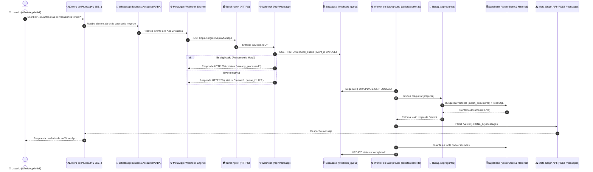

# Canal WhatsApp con Meta Cloud API (Fase 6): Guía Completa de Implementación y Solución de Problemas

Este documento registra la arquitectura completa, el paso a paso detallado, las decisiones de código y la resolución de incidentes técnicos para conectar **WhatsApp (Meta Cloud API)** al cerebro RAG (**Next.js + LangChain + Gemini + Supabase**) de **chatIA**.

---

## 1. Diagrama de Arquitectura Resiliente (Desacople, Cola Durable y Worker)



---

## 2. Paso a Paso: Configuración Inicial en Meta for Developers

### 2.1 Crear la App y el Portfolio Comercial
1. Acceder a [developers.facebook.com/apps](https://developers.facebook.com/apps/).
2. Crear una nueva aplicación:
   * Tipo de caso de uso: **"Otro"** (*Other*).
   * Tipo de aplicación: **"Negocios"** (*Business*).
   * Asignar nombre: `CHATBOT IA TEST` (o similar).
3. **Creación del Portfolio Comercial (Business Portfolio):**
   * Meta exige que las apps de WhatsApp pertenezcan a un portfolio comercial.
   * Si aparece el modal *"Crea un portfolio comercial"*, pulsar **Continuar**, colocar un nombre (ej. `ChatIA Dev`), tu nombre y correo. Es 100% gratuito y no requiere empresa legal para desarrollo.

### 2.2 Activar el Producto WhatsApp
1. En el panel lateral de la aplicación, buscar **"WhatsApp"** y hacer clic en **"Configurar"** (*Set up*).
2. En el menú desplegable de WhatsApp, ingresar a **"Paso 1. Pruébalo"** (*API Setup* o *Getting Started*).

### 2.3 Obtener las 4 Credenciales Clave
En la pantalla **"Paso 1. Pruébalo"** se encuentran los identificadores necesarios:

| Credencial | Ubicación en Meta | Variable de Entorno | Ejemplo / Formato |
|---|---|---|---|
| **Access Token Temporal** | Botón azul *"Generar token"* en la sección Token de acceso | `WHATSAPP_ACCESS_TOKEN` | `EAAX...` (Cadena alfanumérica larga, válida por 24h) |
| **Phone Number ID** | Casilla *"Phone Number ID"* junto al número de prueba | `WHATSAPP_PHONE_NUMBER_ID` | `1258887770648904` |
| **WhatsApp Business Account ID** | Casilla *"WhatsApp Business account ID"* | Usado para suscripción WABA | `3148800701982517` |
| **Verify Token** | **Lo defines tú** libremente en tu código | `WHATSAPP_VERIFY_TOKEN` | `chatia_token_secreto_2026` |

> [!WARNING]
> Meta muestra dos números largos juntos:
> 1. **Phone Number ID:** Se utiliza en la URL para **enviar mensajes** (`POST /v21.0/{PHONE_ID}/messages`).
> 2. **WhatsApp Business Account ID (WABA ID):** Identifica a la cuenta empresarial dueña del número. Se utiliza para **vincular aplicaciones suscritas** (`subscribed_apps`).

### 2.4 Autorizar y Abrir la Ventana de Conversación de Prueba
Por motivos de privacidad, los números de prueba (`+1 555...`) solo pueden comunicarse con números autorizados:
1. En **"Paso 1. Pruébalo"**, sección **"Destinatario"**, seleccionar **"Administrar lista de números de teléfono"**.
2. Agregar tu número de WhatsApp personal (con código de país) y confirmar el código SMS/WhatsApp de 6 dígitos.
3. **Paso crítico (Iniciar conversación):** Seleccionar tu número en el desplegable y presionar el botón azul **"Enviar mensaje"**.
   * Esto envía la plantilla *"Hello World"* o *"Confirmación de pedido"* a tu celular y **abre la ventana de servicio de 24 horas**. Sin este envío inicial de plantilla, Meta no permite que recibas ni envíes mensajes libres.

---

## 3. Configuración del Entorno y Next.js

### 3.1 Variables de Entorno (`.env`)
En la raíz del proyecto se configuran los valores obtenidos:

```env
# Google Gemini y Supabase (Fases 1 a 5)
GOOGLE_API_KEY="AIzaSy..."
SUPABASE_URL="https://xxxxxxxx.supabase.co"
SUPABASE_SERVICE_ROLE_KEY="eyJhbGci..."

# WhatsApp Cloud API (Fase 6)
WHATSAPP_PHONE_NUMBER_ID="1258887770648904"
WHATSAPP_ACCESS_TOKEN="EAAXxxxxxx..."
WHATSAPP_VERIFY_TOKEN="chatia_token_secreto_2026"
```

### 3.2 Soporte de Dominios de Túnel en `next.config.ts`
Para evitar que Next.js en desarrollo bloquee peticiones entrantes desde dominios de ngrok o dev tunnels:

```typescript
// next.config.ts
import type { NextConfig } from "next";

const nextConfig: NextConfig = {
  allowedDevOrigins: ["*.ngrok-free.app", "*.ngrok-free.dev", "*.ngrok.app"],
};

export default nextConfig;
```

---

## 4. Implementación del Código

### 4.1 Cliente Emisor de WhatsApp (`src/lib/whatsapp.ts`)
Encargado de formatear y despachar mensajes hacia la Graph API de Meta:
* **Límite de caracteres:** WhatsApp admite hasta 4096 caracteres por mensaje. Se implementó `chunkMessage()` para segmentar respuestas extensas en párrafos sin cortar oraciones.
* **Llamada a Meta Graph API:**
  `POST https://graph.facebook.com/v21.0/${phoneNumberId}/messages`
  con encabezado `Authorization: Bearer ${token}` y payload:
  ```json
  {
    "messaging_product": "whatsapp",
    "recipient_type": "individual",
    "to": "58412XXXXXXX",
    "type": "text",
    "text": { "preview_url": false, "body": "Texto de respuesta..." }
  }
  ```

### 4.2 Endpoint Webhook (`src/app/api/whatsapp/route.ts`)
Implementa las dos operaciones requeridas por Meta con runtime Node.js (`export const runtime = "nodejs"`):

#### 1. Verificación del Webhook (`GET`)
Meta realiza un handshake HTTP inicial con tres parámetros de consulta:
* `hub.mode`: Debe ser `"subscribe"`.
* `hub.verify_token`: Debe coincidir exactamente con `WHATSAPP_VERIFY_TOKEN`.
* `hub.challenge`: Código aleatorio que el endpoint debe devolver como texto plano con HTTP 200.

#### 2. Recepción de Mensajes (`POST`)
* **Soporte dual de estructura:** Soporta tanto el payload de producción (`entry[0].changes[0].value`) como el payload del simulador web de Meta (`body.value`).
* **Filtro de estados:** Descarta silenciosamente notificaciones de entrega o lectura (`statuses: [{ status: "delivered" }]`) respondiendo `200 OK` para no saturar el servidor ni llamar a la IA innecesariamente.
* **Control de Idempotencia:** Mantiene en memoria una lista de IDs procesados (`processedMessageIds = new Set<string>()`). Si Meta reintenta la misma entrega por lentitud de red, se detecta el `message.id` (`wamid`) y se ignora el duplicado.
* **Cerebro RAG e Historial:** Extrae el texto, llama a `preguntar(userQuestion)` de `src/lib/rag.ts`, guarda la conversación en Supabase (`tabla conversaciones`) y envía la respuesta al usuario mediante `sendWhatsAppMessage()`.

---

## 5. Exposición Pública Local (Túnel ngrok)

Meta exige una URL pública con HTTPS obligatorio para los webhooks:

1. **Configurar el authtoken de ngrok:**
   ```bash
   npx ngrok config add-authtoken <TU_AUTHTOKEN_DE_NGROK>
   ```
2. **Levantar el túnel al puerto de Next.js (3000):**
   ```bash
   npx ngrok http 3000
   ```
3. ngrok genera una URL HTTPS pública (ej. `https://entwine-strobe-cultivate.ngrok-free.dev`).
4. La URL final del webhook es:
   `https://entwine-strobe-cultivate.ngrok-free.dev/api/whatsapp`

---

## 6. Configuración del Webhook en Meta Developers

1. En el panel de Meta, en el menú lateral izquierdo ir a **Webhooks** (o dentro de **WhatsApp** ➔ **Configuración**).
2. En la lista desplegable de producto, seleccionar **`Whatsapp Business Account`**.
3. Presionar **"Editar"** o configurar:
   * **URL de devolución de llamada:** `https://<tu-subdominio-ngrok>/api/whatsapp`
   * **Token de verificación:** El valor de `WHATSAPP_VERIFY_TOKEN` (`chatia_token_secreto_2026`).
4. Hacer clic en **"Verificar y guardar"**.
   * En la terminal local se observará: `✅ [Webhook WhatsApp] Verificación exitosa de Meta. (HTTP 200)`.
5. En la tabla de **Campos del webhook**, buscar **`messages`** y marcar el interruptor como **"Suscrito"**.

---

## 7. El Incidente Clave y su Solución: Vinculación WABA (`subscribed_apps`)

### El Problema Detectado:
Al probar el botón del simulador web de Meta (*"Enviar al servidor"*), la petición llegaba a Next.js y la IA respondía. **Sin embargo**, al escribir directamente desde la aplicación de WhatsApp en el celular, la terminal no recibía ninguna petición `POST`.

### Causa Raíz:
En la arquitectura de Meta, existen dos niveles:
1. **La App:** Sabe a qué URL de webhook despachar datos.
2. **La Cuenta de WhatsApp Business (WABA):** Es la entidad propietaria del número de teléfono.

Por defecto, crear una app y suscribir el campo `messages` **no suscribe automáticamente la cuenta de WhatsApp (WABA) a esa App**. Por lo tanto, cuando un usuario escribe al número de teléfono, la WABA no tiene la instrucción de despacharle los eventos a la App del desarrollador.

### Solución Definitiva (Comando de Vinculación):
Se debe ejecutar una petición HTTP hacia el endpoint `subscribed_apps` de la WABA:

```bash
curl -X POST "https://graph.facebook.com/v21.0/{WABA_ID}/subscribed_apps" \
  -H "Authorization: Bearer {WHATSAPP_ACCESS_TOKEN}" \
  -H "Content-Type: application/json"
```

O mediante un script rápido con Node.js:

```javascript
const token = process.env.WHATSAPP_ACCESS_TOKEN;
const wabaId = "3148800701982517"; // Tu WhatsApp Business Account ID

await fetch(`https://graph.facebook.com/v21.0/${wabaId}/subscribed_apps`, {
  method: "POST",
  headers: {
    Authorization: `Bearer ${token}`,
    "Content-Type": "application/json"
  }
});
```

**Respuesta exitosa de Meta:**
```json
{
  "success": true
}
```

Al consultar la lista (`GET /{WABA_ID}/subscribed_apps`), la App `CHATBOT IA TEST` queda formalmente enlazada a la recepción de eventos del número telefónico.

---

## 8. Verificación y Pruebas Automatizadas

Se creó el script de pruebas de integración [`scripts/test-whatsapp.ts`](../scripts/test-whatsapp.ts), ejecutable con:

```bash
npm run test:whatsapp
```

### Resultados de la Suite de Pruebas:
* 1️⃣ **Handshake GET:** Valida respuesta 200 con `hub.challenge` ante tokens correctos.
* 2️⃣ **Seguridad GET:** Valida rechazo con código 403 ante tokens no autorizados.
* 3️⃣ **Filtro de Estado POST:** Valida que eventos `delivered`/`read` respondan 200 sin invocar modelos LLM.
* 4️⃣ **Procesamiento RAG POST:** Valida extracción del texto de la pregunta, consulta semántica a Supabase y generación de respuesta limpia en texto plano con Gemini.
* 5️⃣ **Idempotencia POST:** Valida que reenviar el mismo `wamid` devuelva `{ status: "already_processed" }` sin duplicar respuestas.

---

## 9. Lista de Comprobación para Nuevos Entornos

Si en el futuro se despliega en producción (Vercel) o se cambia de número:
1. [ ] Definir `WHATSAPP_ACCESS_TOKEN`, `WHATSAPP_PHONE_NUMBER_ID` y `WHATSAPP_VERIFY_TOKEN` en variables de entorno.
2. [ ] Configurar la URL pública de producción (`https://tu-dominio.vercel.app/api/whatsapp`) en el Webhook de Meta.
3. [ ] Suscribir el campo `messages` en la tabla de Webhooks.
4. [ ] Ejecutar `POST /{WABA_ID}/subscribed_apps` para garantizar que la WABA envíe los eventos a la App.
5. [ ] Para producción permanente: generar un **Token de Usuario de Sistema** con permisos `whatsapp_business_messaging` en [business.facebook.com/settings](https://business.facebook.com/settings) para que el token no expire cada 24 horas.
