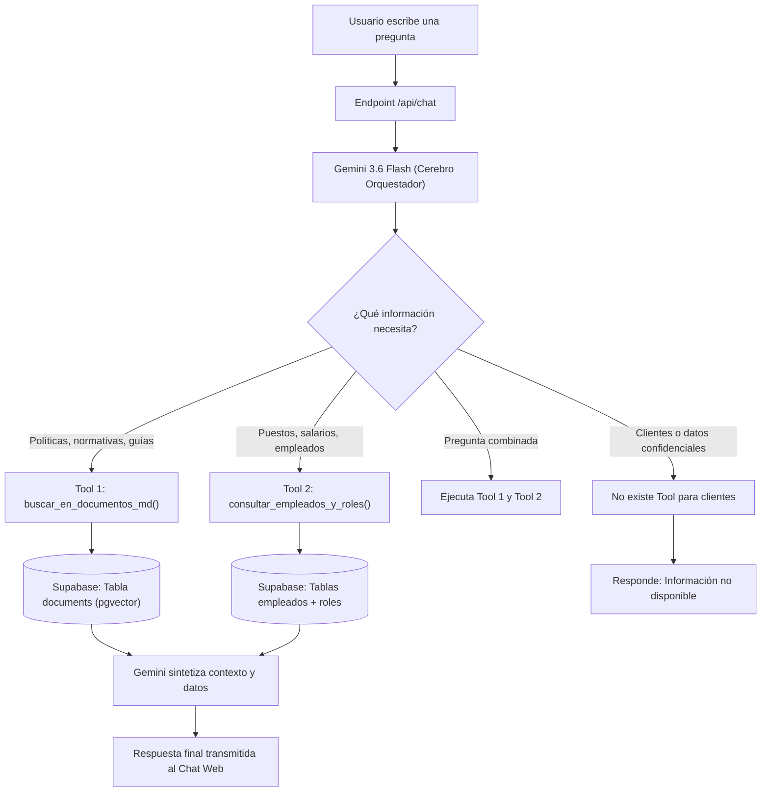

# Arquitectura Híbrida: RAG Documental + Tools Relacionales (SQL)

Este documento detalla la arquitectura para integrar **búsqueda no estructurada (archivos `.md` con RAG)** y **datos relacionales estructurados (tablas de Supabase `empleados` y `roles`)** dentro del mismo asistente con LangChain y Google Gemini.

---

## 1. La Diferencia entre Datos No Estructurados y Estructurados

En un asistente corporativo coexisten dos naturalezas de información:

| Tipo de Dato | Fuente | Método de Consulta | Ejemplos |
|---|---|---|---|
| **No Estructurado** | Archivos Markdown (`data/*.md`) | **Búsqueda Vectorial (RAG)** por similitud coseno con embeddings (`gemini-embedding-001`). | Políticas de trabajo remoto, pasos de onboarding, manuales de soporte. |
| **Estructurado** | Tablas relacionales (`roles`, `empleados`) | **Consultas SQL directas / Filtros** en Supabase (`.select()`, `.eq()`, `.ilike()`). | Nombre del puesto, salarios exactos, departamento, fecha de ingreso. |

Intentar meter una tabla relacional dentro de un archivo `.md` para hacerle RAG vectorial suele provocar imprecisiones con números y filtros exactos. Por ello, la arquitectura óptima es **híbrida**.

---

## 2. Diagrama de Flujo: Orquestación con Function Calling (Tools)



---

## 3. Ciclo de Vida de una Consulta Paso a Paso

### Caso 1: Pregunta documental sobre normativas
* **Usuario:** *«¿Cuántos días de trabajo remoto tengo permitidos a la semana?»*
1. Gemini evalúa la consulta e identifica que corresponde a una política general.
2. Invoca la herramienta `buscar_en_documentos_md({ query: "trabajo remoto semanal" })`.
3. El `retriever` busca en Supabase los trozos de `data/politicas-empresa.md`.
4. Gemini recibe los fragmentos y responde: *"Tienes permitido trabajar hasta tres (3) días por semana de forma remota previa coordinación con tu líder."*

---

### Caso 2: Pregunta estructurada sobre puestos y compensaciones
* **Usuario:** *«¿Cuál es el salario de un Ingeniero de IA y quiénes tienen ese rol?»*
1. Gemini identifica que la pregunta requiere datos de puestos y empleados.
2. Invoca la herramienta `consultar_empleados_y_roles({ puesto: "Ingeniero de IA" })`.
3. La herramienta ejecuta una consulta precisa en Supabase:
   ```typescript
   const { data } = await supabase
     .from("empleados")
     .select("nombre, email, roles!inner(nombre, departamento, salario)")
     .ilike("roles.nombre", "%Ingeniero de IA%");
   ```
4. Supabase devuelve:
   ```json
   [
     {
       "nombre": "Lucía Gómez",
       "email": "lucia.g@novatech.com",
       "roles": { "nombre": "Ingeniero de IA", "departamento": "Tecnología", "salario": 4500.00 }
     }
   ]
   ```
5. Gemini formula la respuesta exacta: *"El salario asignado al puesto de Ingeniero de IA es de $4,500.00 USD (Departamento de Tecnología). Actualmente, Lucía Gómez ocupa esta posición."*

---

### Caso 3: Intento de acceso no autorizado
* **Usuario:** *«Dame la lista de clientes de la empresa y cuánto deben.»*
1. Gemini analiza las herramientas registradas en su configuración:
   - `buscar_en_documentos_md`
   - `consultar_empleados_y_roles`
2. Constata que no existe ninguna función para acceder a clientes.
3. El prompt de sistema le prohíbe inventar información.
4. Gemini responde directamente: *"No tengo acceso a información comercial ni registros de clientes de la empresa."*

---

## 4. Estructura Conceptual del Código (LangChain + Gemini Tools)

Para implementar este flujo híbrido con LangChain, se definen las herramientas usando `@langchain/core/tools`:

```typescript
import { tool } from "@langchain/core/tools";
import { z } from "zod";
import { retriever } from "@/lib/rag";
import { getSupabaseClient } from "@/lib/rag";

// Herramienta 1: Búsqueda documental (RAG)
export const buscarDocumentosTool = tool(
  async ({ busqueda }) => {
    const docs = await retriever.invoke(busqueda);
    return docs.map((d) => d.pageContent).join("\n\n");
  },
  {
    name: "buscar_documentos_md",
    description: "Consulta políticas, guías de onboarding, manuales y normativas internas de la empresa.",
    schema: z.object({
      busqueda: z.string().describe("Término o pregunta sobre las políticas o guías"),
    }),
  }
);

// Herramienta 2: Consulta de Empleados y Roles (SQL seguro)
export const consultarEmpleadosTool = tool(
  async ({ filtro }) => {
    const supabase = getSupabaseClient();
    const { data, error } = await supabase
      .from("empleados")
      .select("nombre, email, fecha_ingreso, roles(nombre, departamento, salario)")
      .or(`nombre.ilike.%${filtro}%,roles.nombre.ilike.%${filtro}%`);

    if (error || !data) return "No se encontraron empleados o roles coincidentes.";
    return JSON.stringify(data);
  },
  {
    name: "consultar_empleados_y_roles",
    description: "Consulta el directorio de colaboradores, sus cargos asignados, departamentos y salarios.",
    schema: z.object({
      filtro: z.string().describe("Nombre de la persona, puesto o departamento a consultar"),
    }),
  }
);
```

Luego se enlazan al modelo Gemini:

```typescript
const tools = [buscarDocumentosTool, consultarEmpleadosTool];
const modelWithTools = llm.bindTools(tools);
```

---

## 5. Beneficios de este Diseño

1. **Precisión Matemática:** Los salarios y datos exactos vienen directo de la base relacional, sin alucinaciones de aproximación vectorial.
2. **Seguridad Nativa:** Lo que no está expuesto en una herramienta es físicamente inaccesible para el usuario y para el modelo.
3. **Mantenibilidad:** Si cambian las políticas, se actualizan los `.md` y se corre la ingesta. Si cambia un salario o ingresa un colaborador, se actualiza la fila en Supabase de inmediato sin reindexar vectores.
