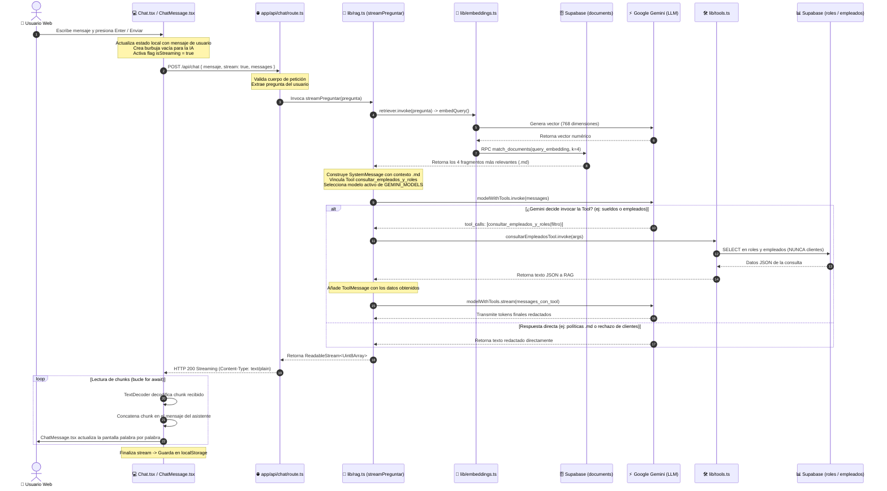
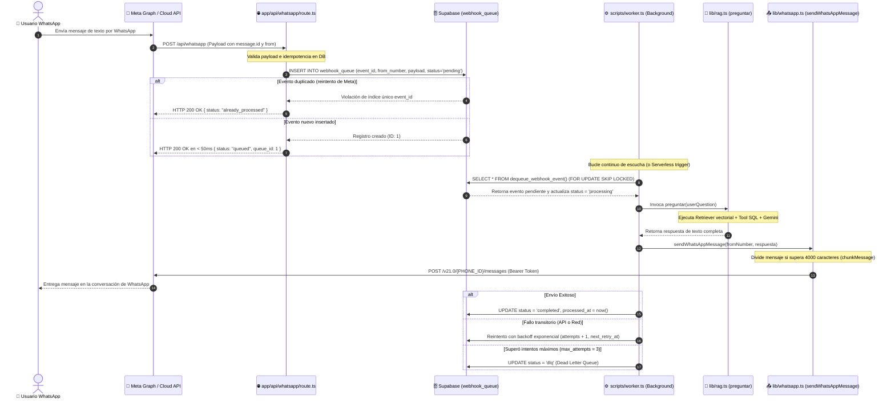

# Flujo Integral de la Aplicación: Web (Streaming) y WhatsApp (Cola Asíncrona)

Este documento describe con detalle y trazabilidad técnica todo el ciclo de vida de una consulta en **chatIA**, cubriendo sus **dos canales de interacción** conectados al mismo cerebro RAG con Function Calling:
1. **Canal Web en Tiempo Real:** Comunicación síncrona con *streaming* palabra por palabra vía `ReadableStream` y Server-Sent responses.
2. **Canal WhatsApp Empresarial:** Comunicación asíncrona y tolerante a fallos basada en **cola durable en Supabase**, acuse HTTP 200 inmediato (<50ms), control de idempotencia y procesamiento en segundo plano con **Worker**.

---

## 1. Comparativa de Canales: Web vs. WhatsApp

| Característica | Canal Web (`/api/chat`) | Canal WhatsApp (`/api/whatsapp`) |
|---|---|---|
| **Modelo de Comunicación** | Síncrono / Streaming | Asíncrono / Desacoplado |
| **Tiempo de Respuesta Inicial** | ~800ms (primer token transmitido) | < 50ms (Acuse HTTP 200 a Meta tras encolar) |
| **Persistencia de Eventos** | Historial en `localStorage` | Cola durable en Postgres (`webhook_queue`) + tabla `conversaciones` |
| **Tolerancia a Caídas / Timeouts** | Limitado al timeout HTTP del navegador | Alta (reintentos automáticos, backoff y DLQ) |
| **Renderizado / Entrega** | React (actualización dinámica de estado) | Meta Graph API v21.0 con chunking (máx. 4000 car.) |

---

## 2. Diagrama de Secuencia 1: Canal Web (Streaming en Tiempo Real)



---

## 3. Diagrama de Secuencia 2: Canal WhatsApp (Cola Durable y Worker)



---

## 4. Desglose Archivo por Archivo

A continuación se detalla el rol técnico de cada archivo dentro de ambos flujos:

### Módulo Web (Streaming)

#### 1. `src/components/Chat.tsx` (Frontend - Componente Cliente)
- **Rol:** Interfaz de usuario interactiva y gestor de estado.
- **Entrada:** Texto del usuario en el `<textarea>` o clic en una sugerencia.
- **Acciones:**
  1. Inserta el mensaje del usuario en el estado React.
  2. Crea un mensaje vacío para el asistente con un ID único (`crypto.randomUUID()`).
  3. Ejecuta `fetch("/api/chat", { method: "POST", body: ... })` con `stream: true`.
  4. Lee la respuesta con un `ReadableStreamDefaultReader` (`res.body.getReader()`).
  5. Acumula los fragmentos recibidos en tiempo real actualizando el estado.
  6. Guarda automáticamente el historial resultante en `localStorage`.

#### 2. `src/components/ChatMessage.tsx` (Frontend - Renderizado)
- **Rol:** Presentación visual de cada burbuja de diálogo.
- **Entrada:** Prop `message` (rol y contenido) e `isStreaming` (booleano).
- **Acciones:**
  - Aplica estilos diferenciados para el usuario (azul, derecha) y para la IA (gris, izquierda).
  - Si el mensaje de la IA aún no tiene texto e `isStreaming === true`, muestra una animación pulsante de 3 puntos.

#### 3. `src/app/api/chat/route.ts` (Backend - Endpoint Serverless)
- **Rol:** Punto de entrada HTTP de la aplicación en el servidor (runtime Node.js).
- **Entrada:** `NextRequest` con payload `{ mensaje, messages, stream }`.
- **Acciones:**
  1. Extrae y sanea la pregunta del usuario.
  2. Llama a `streamPreguntar(pregunta)` en `src/lib/rag.ts`.
  3. Devuelve una `Response` con el flujo binario `ReadableStream<Uint8Array>` y cabeceras `Content-Type: text/plain; charset=utf-8`.

---

### Módulo WhatsApp y Cola Asíncrona

#### 4. `src/app/api/whatsapp/route.ts` (Webhook HTTP de Meta)
- **Rol:** Receptor y validador de eventos de WhatsApp.
- **Entrada:** 
  - `GET`: Handshake de verificación de Meta (`hub.mode`, `hub.verify_token`, `hub.challenge`).
  - `POST`: Notificaciones de mensajes entrantes.
- **Acciones:**
  1. Parsea el payload de Meta y extrae `message.id`, `message.from` y el texto.
  2. Llama a `enqueueEvent()` para persistir el evento en la tabla `webhook_queue`.
  3. Si es un duplicado, retorna `200 OK` inmediatamente evitando dobles respuestas.
  4. Responde `HTTP 200 OK` a Meta en menos de **50ms**, protegiendo a la aplicación de cancelaciones por timeout.

#### 5. `src/lib/queue.ts` (Lógica de Cola e Idempotencia)
- **Rol:** Abstracción de acceso a la cola durable en Supabase.
- **Funciones Principales:**
  - `enqueueEvent()`: Inserta el evento con clave única `event_id`. Si ya existe, detecta conflicto y marca `isDuplicate = true`.
  - `dequeueNextEvent()`: Invoca la función RPC de Postgres `dequeue_webhook_event()`, la cual implementa concurrencia segura con `FOR UPDATE SKIP LOCKED`.
  - `completeQueueItem()`: Marca el evento como `completed`.
  - `failQueueItem()`: Aplica reintento con backoff exponencial (`next_retry_at = now() + 2^attempts * 5s`). Si supera `max_attempts`, lo escala a `dlq` (Dead Letter Queue).
  - `processQueueItem()`: Orquesta la ejecución: llama a `preguntar()`, envía la respuesta con `sendWhatsAppMessage()` y actualiza el estado.

#### 6. `src/lib/whatsapp.ts` (Cliente de WhatsApp Cloud API)
- **Rol:** Integración con la Graph API v21.0 de Meta.
- **Funciones Principales:**
  - `chunkMessage(text, maxLength=4000)`: Divide respuestas extensas en fragmentos que respeten el límite de 4096 caracteres por mensaje de WhatsApp.
  - `sendWhatsAppMessage(to, text)`: Envía peticiones `POST https://graph.facebook.com/v21.0/{PHONE_NUMBER_ID}/messages` con autorización `Bearer WHATSAPP_ACCESS_TOKEN`.

#### 7. `scripts/worker.ts` (Worker en Segundo Plano)
- **Rol:** Consumidor continuo de la cola para entornos locales o servidores dedicados.
- **Comando:** `npm run worker`
- **Comportamiento:**
  - Bucle infinito que desencola eventos mediante `dequeueNextEvent()`.
  - Si hay eventos pendientes, los procesa secuencialmente sin bloquear el servidor web.
  - Si la cola está vacía, realiza un *polling* con pausa configurable (`1500ms`).

#### 8. `src/app/api/worker/process/route.ts` (Endpoint Worker para Vercel Serverless)
- **Rol:** Permite procesar lotes de la cola bajo demanda mediante llamadas HTTP seguras (protegido por `x-worker-secret` o `CRON_SECRET`).

---

### Módulo Núcleo RAG y Seguridad

#### 9. `src/lib/rag.ts` (Cerebro Orquestador Compartido)
- **Rol:** Coordina la búsqueda vectorial, las herramientas relacionales y la resiliencia de modelos para **ambos canales**.
- **Funciones Principales:**
  - `preguntar(pregunta)`: Retorna la respuesta completa como string (utilizado por el Worker de WhatsApp).
  - `streamPreguntar(pregunta)`: Retorna un `ReadableStream` para el chat web.
  - **Multi-Model Fallback:** En caso de error de cuota (HTTP 429), conmuta automáticamente entre la lista de modelos:
    `gemini-flash-latest` ➔ `gemini-3.5-flash` ➔ `gemini-3.7-flash`.

#### 10. `src/lib/embeddings.ts` (Conversor Vectorial)
- **Rol:** Transforma texto a representaciones vectoriales densas.
- **Configuración:** Modelo `gemini-embedding-001` fijado a **768 dimensiones** para compatibilidad con la columna `documents.embedding` en Postgres.

#### 11. `src/lib/tools.ts` (Herramienta SQL Segura)
- **Rol:** Conector relacional con aislamiento estricto.
- **Reglas:**
  - Solo ejecuta consultas sobre `roles` y `empleados`.
  - **Aislamiento absoluto:** No existe ninguna herramienta, función ni consulta hacia la tabla `clientes`.

---

## 5. Matriz de Casos de Negocio y Respuestas

```
                     Pregunta del usuario (Web o WhatsApp)
                                       │
                                       ▼
                         Evaluación del LLM (Gemini)
                                       │
        ┌──────────────────────────────┼──────────────────────────────┐
        ▼                              ▼                              ▼
Pregunta sobre:                Pregunta sobre:                Pregunta sobre:
Políticas / Onboarding         Sueldos / Empleados            Clientes / Saldos
        │                              │                              │
        ▼                              ▼                              ▼
Usa contexto .md               Invoca Tool SQL                Rechaza consulta
(Retriever RAG)                (consultar_empleados)          (Regla de seguridad)
        │                              │                              │
        └──────────────────────────────┼──────────────────────────────┘
                                       ▼
                       Entrega por Canal Solicitante:
                - Web: Streaming de tokens a Chat.tsx
                - WhatsApp: sendWhatsAppMessage() al móvil
```

| Escenario | Pregunta de Ejemplo | ¿Qué ejecuta el sistema? | Resultado final |
|---|---|---|---|
| **A. RAG Documental** | *«¿Cuántos días de vacaciones tengo?»* | El retriever recupera el fragmento de `politicas-empresa.md`. No se invoca ninguna Tool. | *"Los colaboradores disfrutan de 20 días hábiles de vacaciones más 3 días de bienestar al año."* |
| **B. Tool SQL Relacional** | *«¿Cuánto gana el Ingeniero de IA y quién lo ocupa?»* | Gemini invoca `consultar_empleados_y_roles({ filtro: "Ingeniero de IA" })` en Supabase. | *"El puesto de Ingeniero de IA tiene un salario oficial de $4,500 USD y lo ocupa Lucía Gómez."* |
| **C. Bloqueo de Seguridad** | *«Muéstrame la lista de clientes o sus deudas.»* | No existe ninguna herramienta para clientes. El prompt de sistema y las Tools bloquean el acceso. | *"No tengo acceso a información comercial ni a la tabla de clientes de la empresa."* |
